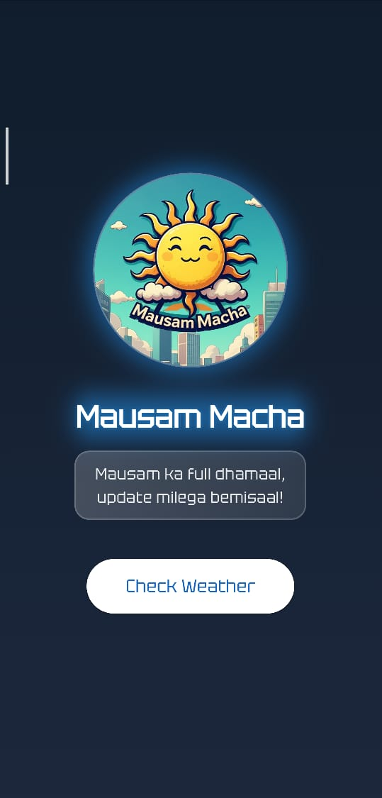
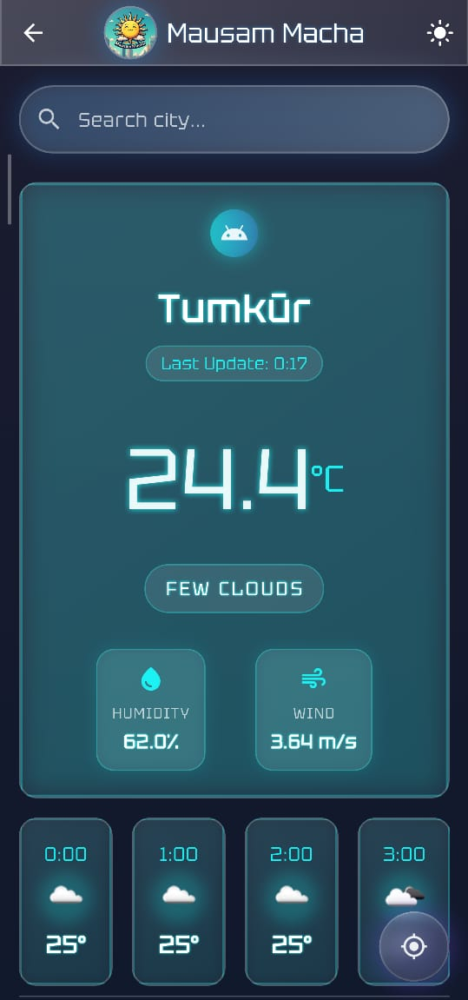
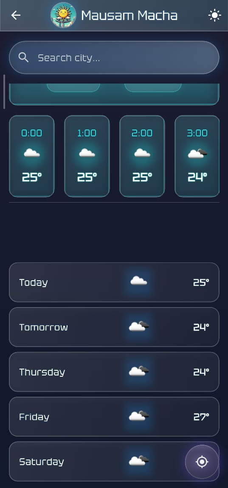

# Mausam Macha


## 🌤 Weather Forecasting App Built with Flutter
**Mausam Macha** is a sleek and modern weather application that provides real-time weather updates with an engaging user interface. Built using **Flutter**, the app leverages API-driven data to display current, hourly, and weekly forecasts with interactive UI elements.

---

## 📸 Screenshots
<p align="center">
  
  
  
</p>


---

## 🚀 Features
- 🌍 **Real-time Weather Data**: Fetches live weather updates for any city.
- 🔎 **City Search Functionality**: Search for weather information of different cities.
- 📅 **Hourly & Weekly Forecast**: Displays temperature trends for upcoming hours and days.
- 🎨 **Modern UI**: Neon-themed futuristic interface with smooth transitions.

---

## 🛠 Tech Stack
- **Framework:** Flutter (Dart)
- **State Management:** Provider
- **API:** OpenWeatherMap API
- **UI Components:** Flutter Widgets & Custom Animations

---

## 🏗 Installation & Setup
### Prerequisites
- Install **Flutter SDK**: [Get Started](https://flutter.dev/docs/get-started/install)
- Install **Dart**: Included with Flutter
- Set up an Android/iOS emulator or a physical device

### Steps
```sh
# Clone the repository
git clone https://github.com/Mahesh5726/Mausam-Macha.git
cd Mausam-Macha

# Install dependencies
flutter pub get

# Run the app
flutter run
```

---

## 🔧 API Configuration
1. Create a free account on [OpenWeatherMap](https://openweathermap.org/)
2. Get your API key.
3. Add the API key in `lib/services/api_service.dart`:
```dart
const String _apiKey = "YOUR_API_KEY_HERE";
```

---

## 📌 To-Do
- [ ] Implement Dark Mode
- [ ] Add Geolocation-based Weather Updates
- [ ] Enhance UI Animations

---

## 🤝 Contributing
Contributions are welcome! If you’d like to contribute:
1. Fork the repo
2. Create a feature branch (`feature-newFeature`)
3. Commit your changes
4. Push and create a Pull Request

---

## 📝 License
This project is **MIT Licensed**. Feel free to use and modify!

---

💡 *Stay updated with the weather, always!* 🌦

<<<<<<< HEAD
=======
## License
This project is licensed under the MIT License. See the [LICENSE](LICENSE.txt) file for details.

Copyright (C) 2025. All rights reserved.
>>>>>>> 3fed937fcdff6bc6c9c778c8cf8440298684cef9
